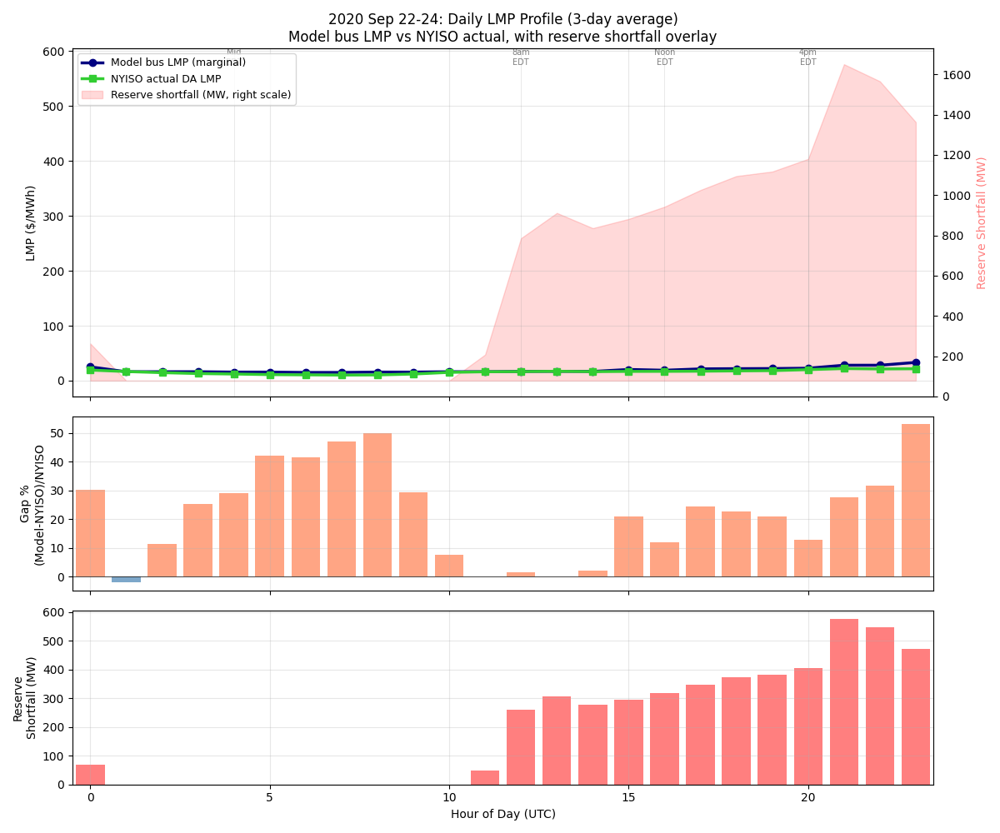

# Dynamic Range Diagnostic: 2020 Sep 22-24

**Date**: 2026-04-28

## Summary

The model does NOT compress dynamic range. Peak-to-trough ratio is
2.2x for both model and NYISO. The +12% system-average overestimation
is a near-uniform parallel shift of ~$5/MWh at all hours, driven by
two mechanisms.

## (a) Daily LMP profile

| Period | Model | NYISO | Gap |
|--------|------:|------:|:---:|
| Trough (3-4am EDT) | $15.0 | $10.2 | +47% |
| Midday (8-9am EDT) | $16.9 | $16.5 | +2% |
| Evening peak (6-7pm EDT) | $30.6 | $21.5 | +43% |

## (b) Peak-to-trough ratio

| | Peak | Trough | Ratio |
|------|-----:|-------:|:-----:|
| Model | $33.2 | $15.0 | **2.22x** |
| NYISO | $22.0 | $10.2 | **2.16x** |

Ratio of ratios: 1.02x. The model captures 102% of NYISO's dynamic
range. The R-squared of 0.32 reflects the uniform LMP issue (no
zonal variation), not dynamic range compression.

## (c) Worst-disagreement hours

The largest percentage gaps are at **off-peak** (3-5am EDT, +41-50%)
and **evening peak** (6-7pm EDT, +43-53%). Midday is the best match
(+2%).

Critically, **reserve shortfall is zero at off-peak hours.** The
off-peak overestimate is NOT from RS penalties. It's from the model's
floor price being too high ($15/MWh vs NYISO's $10).

## (d) Marginal generators

| Period | Marginal unit | Marginal cost |
|--------|--------------|:-------------:|
| Off-peak | Glenwood GT | ~$22/MWh |
| Midday | Bayonne CT | ~$33/MWh |
| Evening peak | Bayonne CTs | ~$33/MWh |

The same gas CTs (Bayonne, Glenwood) are marginal at most hours.
106 generators stay committed overnight (vs 113 at peak, only 7
fewer). Min-up constraints prevent decommitment of the thermal fleet.

## (e) Root cause: uniform floor price

The model's off-peak LMP of $15/MWh is the marginal cost of the
cheapest gas unit that's still committed due to min-up constraints.
NYISO's off-peak LMP is $10/MWh because:

1. **Zonal pricing**: NYISO's load-weighted average pulls toward
   cheap upstate zones ($5-8/MWh) where hydro and nuclear dominate
   off-peak. The model, with uniform LMPs, prices all zones at the
   system-wide marginal cost.

2. **Self-scheduling**: In real NYISO operations, some gas units
   self-schedule at off-peak and effectively bid at $0, pulling the
   market clearing price down. The model doesn't capture this.

3. **Bilateral import scheduling**: Real HQ and NE imports adjust
   hourly based on bilateral schedules, sometimes increasing off-peak
   flow when NY prices are low. The model uses fixed import costs.

## Hypothesis resolution

| Hypothesis | Verdict |
|-----------|---------|
| RS at off-peak inflates LMPs | **NO** — RS is zero off-peak |
| Min-up keeps expensive units online | **YES** — 106/113 units stay on |
| Uniform LMPs prevent cheap upstate pricing | **YES** — biggest factor |
| No zonal reserves | **Contributing** — can't separate effect from uniform LMPs |

## Implication for Phase B

The single highest-value improvement is **zonal LMP differentiation**
(either via zonal reserves or Kron scale adjustment). This would:
- Lower the off-peak system-average LMP by reflecting cheap upstate
  prices in the load-weighted average
- Raise the peak LMP by reflecting expensive downstate prices
- Potentially improve R-squared from 0.32 to >0.5

Reserve calibration alone won't help — RS is already zero off-peak.
