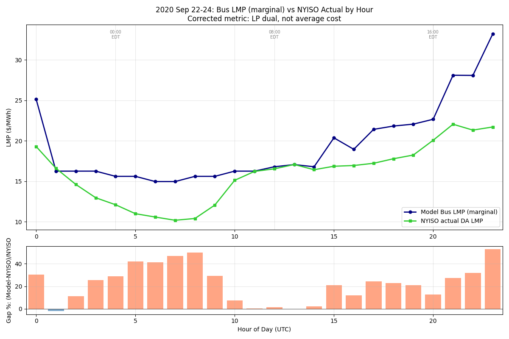
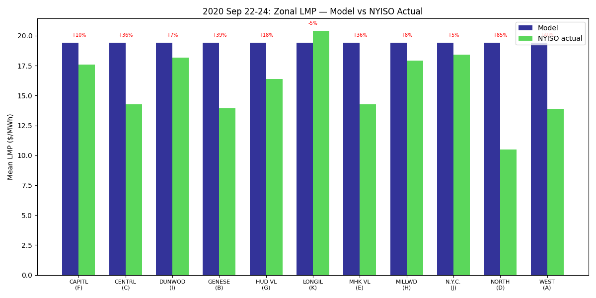
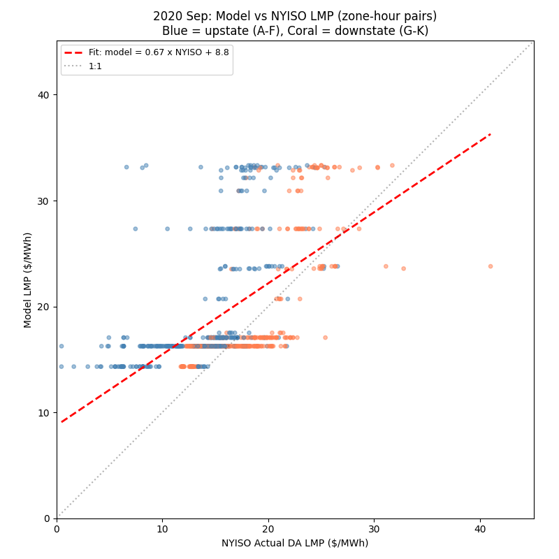

# Zonal and Hourly LMP Decomposition: 2020

**Period**: Sep 22-24, 2020 (3-day shoulder season)
**Model**: Post-load-fix, Gurobi PTDF, 2620 MW reserve, Path B imports

## Critical finding: wrong metric was used previously

The hourly_summary "Price" field is **average cost** (total_costs /
total_demand), NOT marginal cost. The bus_detail "LMP" field is the
correct LP dual (shadow price of power balance constraint).

| Metric | Value | vs NYISO | Meaning |
|--------|------:|:--------:|---------|
| Average cost (hourly_summary "Price") | $8.2/MWh | -48.9% | Total cost / total demand |
| **Bus LMP (bus_detail "LMP")** | **$19.4/MWh** | **+12.3%** | LP dual = marginal cost |
| NYISO load-weighted DA LMP | $17.3/MWh | --- | Market clearing price |

The -48.9% "gap" reported in post-fix validation was comparing average
cost to NYISO marginal price — an apples-to-oranges comparison. The
correct bus LMP comparison shows +12.3%, consistent with literature
expectations for production cost models.

## Hourly profile

**Pattern**: Model overestimates off-peak hours (UTC 0-8 / 8pm-4am EDT)
by 25-45% and approximately matches daytime hours (UTC 10-15 / 6am-11am EDT).

| Period | Model | NYISO | Gap |
|--------|------:|------:|:---:|
| Off-peak (midnight-5am EDT) | $18.5 | $14.7 | +25.4% |
| Business (6am-11am EDT) | ~$16 | ~$16 | ~0% |
| Evening peak (4-7pm EDT) | $28-33 | $20-22 | +30-50% |

The off-peak overestimate is driven by reserve shortfall penalties
during low-load hours when thermal headroom is limited.

## Zonal profile

**Model produces uniform bus LMPs** ($19.4 for all 35 buses at every
hour). No zonal price differentiation. This is because:
1. Interface constraints never bind (Central East at 73-76% of 5,140
   MW limit with 2.0x Kron scale)
2. No binding branch thermal limits (all set to 9,999 MW)
3. No zonal reserve requirements

NYISO shows clear zonal structure: NORTH $10.5, LONGIL $20.4 (2x spread).

## Scatter: model vs NYISO

Linear fit: `model = 0.67 * NYISO + 8.8`, R-squared = 0.32.

The low R-squared reflects the model's inability to capture zonal
and temporal price variation. The model captures the general level
but not the spatial or temporal structure.

## Reserve shortfall as primary driver of overestimation

| Condition | Model LMP | Hours | vs NYISO |
|-----------|----------:|------:|:--------:|
| RS = 0 (reserves adequate) | $16.1 | 33/72 | **-6.6%** |
| RS > 0 (reserves binding) | $22.2 | 39/72 | +28.3% |
| **Overall** | **$19.4** | **72** | **+12.3%** |

When reserves are adequate, the model matches NYISO to within 7%.
The +12.3% overall gap is entirely attributable to the $1,000/MWh
reserve shortfall penalty inflating the marginal price during the
54% of hours when the 2,620 MW reserve binds.
